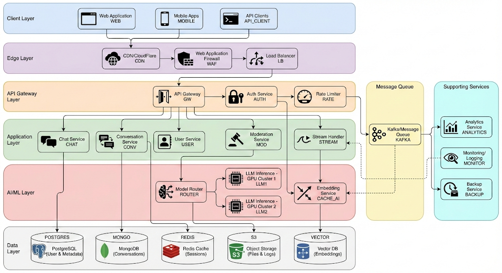

# Building ChatGPT at Scale: A Complete System Design Deep Dive

An in-depth exploration of designing a production-ready conversational AI system capable of serving 100 million users

---

## Introduction

Conversational AI systems like ChatGPT have revolutionized how we interact with technology. Behind the simple chat interface lies a complex distributed system that must handle millions of concurrent users, process billions of requests daily, and deliver responses in real-time while managing massive computational costs.

In this comprehensive guide, I'll guide you through the design of a ChatGPT-like system from the ground up, exploring every architectural decision, calculating exact resource requirements, and addressing the engineering challenges that arise at scale. Whether you're preparing for system design exam or building production AI systems, this article will provide you with practical insights and battle-tested patterns.

## Contents
1. [Requirements Analysis](#requirements-analysis)
2. [High-Level Architecture](#high-level-architecture)
3. [API Design](#api-design)
4. [Capacity Planning & Calculations](#capacity-planning)
5. [Core Building Blocks](#core-building-blocks)
6. [Data Models & Storage](#data-models)
7. [Request Flow & Processing](#request-flow)
8. [Challenges & Solutions](#challenges-and-solutions)
9. [Scalability Strategies](#scalability-strategies)
10. [Technology Stack](#technology-stack)

## Requirements Analysis

1. **Functional Requirements**
    A production-grade conversational AI system must support the following capabilities:

    **Core Features:**
    - Multi-turn conversations with context retention spanning multiple exchanges
    - Real-time streaming responses (token-by-token generation) for improved user experience
    - User authentication, authorization, and session management
    - Persistent conversation history with search and retrieval capabilities
    - Support for multiple concurrent conversations per user
    - Configurable rate limiting and quota management per user tier
    - Content moderation and safety filtering at input and output stages

    **Advanced Features:**
    - Multi-modal support: text, images, documents, and code
    - Code execution in sandboxed environments
    - Web browsing and real-time information retrieval
    - Plugin and tool integration (calculators, APIs, databases)
    - Conversation sharing, export, and collaboration features
    - Cross-platform support: web, mobile (iOS/Android), and desktop applications

2. **Non-Functional Requirements**

    **Performance**
    - *First Token Latency*: < 1 second (time to first response token)
    - *Total Response Time*: < 10 seconds for typical queries
    - *Throughput*: 10,000+ requests per second (RPS) sustained
    - *Concurrent Users*: Support for 100 million+ active users
    - *Availability*: 99.9% uptime (≤ 8.76 hours downtime per year)

    **Scalability**
    - Horizontal scaling across all layers (stateless services)
    - Auto-scaling capabilities to handle traffic spikes (10x normal load)
    - Geographic distribution for global low-latency access
    - Graceful degradation under extreme load conditions

    **Security and Compilance**
    - End-to-end encryption for data in transit (TLS 1.3)
    - Encryption at rest for stored conversations and user data
    - GDPR, CCPA, and SOC 2 compliance
    - DDoS protection and rate limiting at multiple layers
    - Audit logging for security and compliance monitoring

    **Reliability and Fault Tolerance**
    - Multi-region deployment with automatic failover
    - Data replication with configurable consistency levels
    - Retry mechanisms with exponential backoff
    - Circuit breakers for dependent services
    - Zero-downtime deployments with blue-green or canary strategies

## High Level Architecture
The system follows a microservices architecture with clear separation of concerns. Here's the comprehensive architectural overview:
