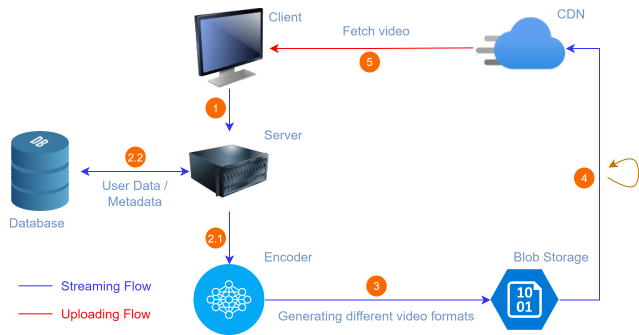
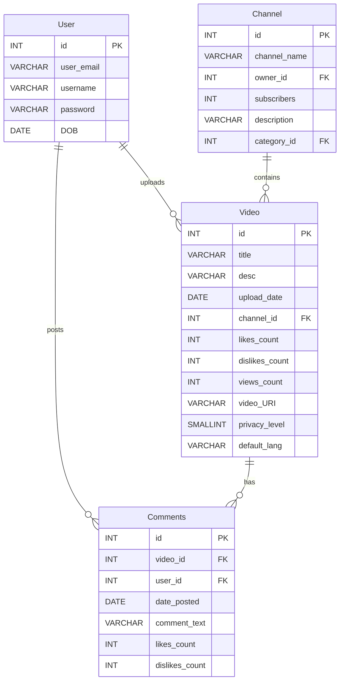

# Design of YouTube 
---


YouTube is is a popular video streaming service where users upload, stream, share, comment, search, like and dislike videos. YouTube allows free hosting of video content to be shared with users globally. Accordingly, large businesses and individuals as well maintain channels where the host their videos. YouTube is considered a primary source of entertainment, especially among young people, and as of 2022, it is listed as the second-most viewed website after Google by [Wikipedia](https://en.wikipedia.org/wiki/List_of_most-visited_websites).

## Requirements of YouTube's Design

1. **Functional Requirements**

    In this article, we require that our system is able to perform the following functions:

    - Stream videos
    - Upload videos
    - Search videos according to titles and keywords
    - Like and dislike videos
    - Add comments to videos
    - View thumbnails

2. **Non-functional Requirements**

    It’s important that our system also meets the following requirements:

    - *High availability*: The system should be highly available. High availability requires a good percentage of uptime. Generally, an uptime of 99% and above is considered good.
    - *Scalability*: As the number of users grows, these issues should not become bottlenecks: storage for uploading content, the bandwidth required for simultaneous viewing, and the number of concurrent user requests should not overwhelm our application/web server.
    - *Good performance*: A smooth streaming experience leads to better performance overall.
    - *Reliability*: Content uploaded to the system should not be lost or damaged.

    However, consistancy is not that strongly required for YouTube's design. Consider the example of a creator uploads a video, not all users subscribed to the creator's channel should immediately get the notification for uploaded content.

    To sum it up, the functional requirements are the features and functionalities that the user will get, whereas the non-functional requirements are the expectations in terms of performance from the system.

    Based on the requirements, we’ll estimate in this article the required resources and design of our system.

## Resource Estimation


## High Level Design




## API Design

- **Upload Video**: The POST method can upload a video to the ```/uploadVideo``` API:

    ```uploadVideo(user_id, video_file, category_id, title, description, tags, default_language, privacy_settings)```

- **Stream Video** The GET method is best suited for the ```/streamVideo``` API:

    ```streamVideo(user_id, video_id, screen_resolution, user_bitrate, device_chipset)```

- **Search Video** The ```/searchVideo``` API uses the GET method:

    ```searchVideo(user_id, search_string, length, quality, upload_date)```

- **View Thumbnails** We can use the GET method to access the ```/viewThumbnails``` API:

    ```viewThumbnails(user_id, video_id)```

- **Like/ Dislike a Video** The like and dislike API uses the POST method to register a like/dislike. As shown below, it’s fairly simple.

    ```likeDislike(user_id, video_id, like)```
- **Comment Video** Much like the like and dislike API, we only have to provide the comment string to the API. This API will also use the POST method.

    ```commentVideo(user_id, video_id, comment_text)```


## Storage Schema

Each of the above features in the API design requires support from the database—we’ll need to store the details above in our storage schema to provide services to the API gateway.




## Detailed Design

### Components

## Design Flow and Tech Stack

## YouTube Search


